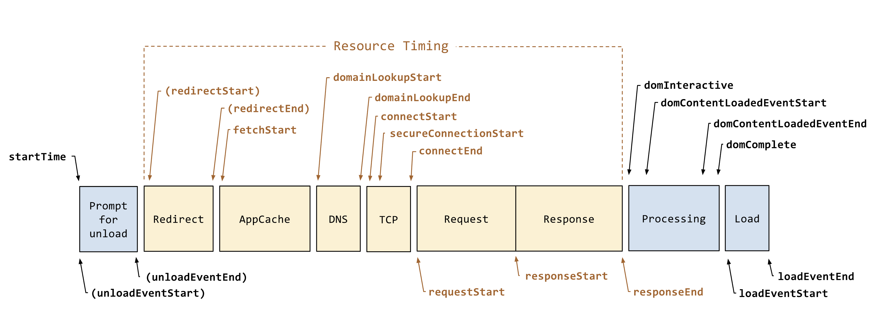
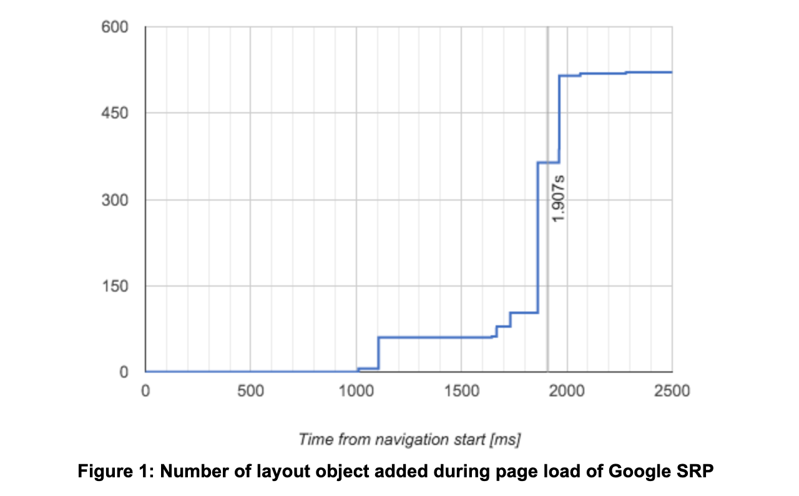
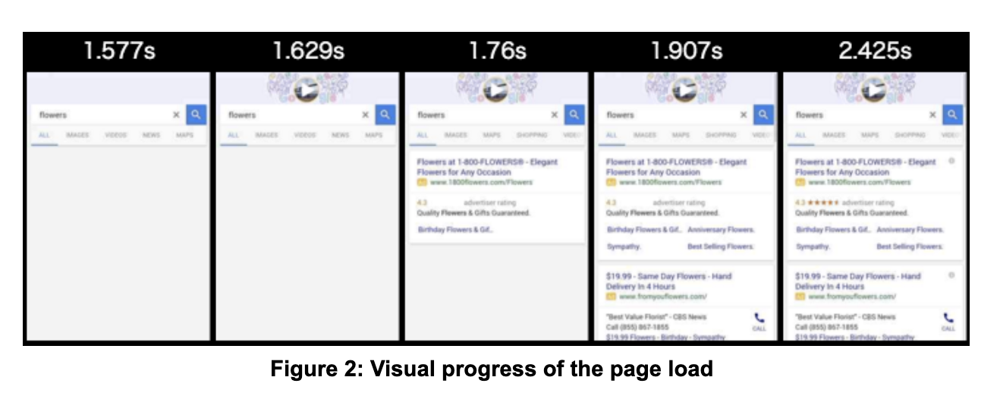
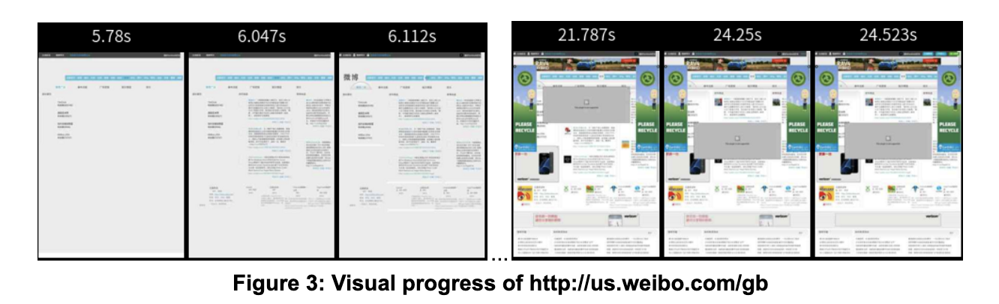
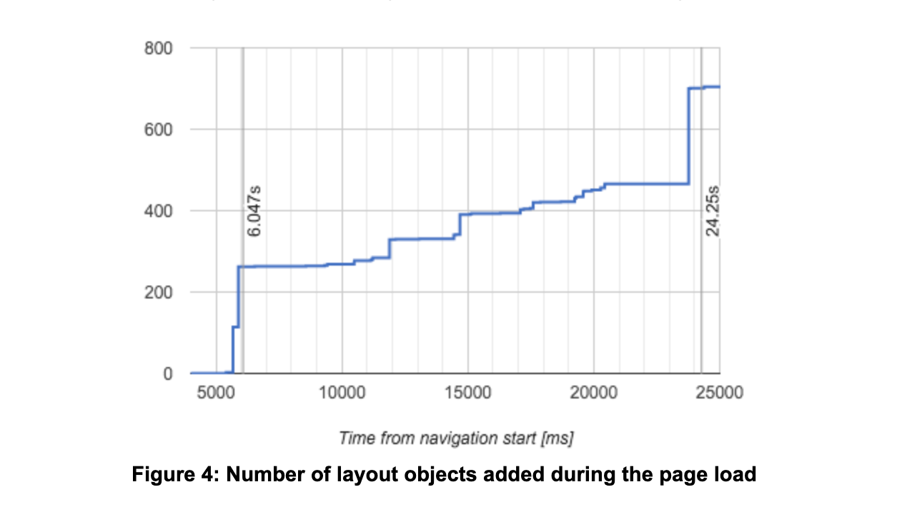

# FMP

## 什么是 FMP

在讨论 FMP 之前，我们先来看下，性能的其他指标。



Navigation Timing API (上图) 是浏览器提供用于衡量网页性能的 Api，通过这个 Api 我们可以计算出网站的一些性能指标，比如：

- FPT : ResponseEnd - FetchStart (白屏时间)
- TTI : DomInteractive - FetchStart (首次可交互时间)
- Ready : DomContentLoadEventEnd - FetchStart (加载完成时间)
- Load : LoadEventStart - FetchStart (页面完全加载时间)

这些指标虽然可以衡量网站的性能情况，但是都无法表示用户是否可以很快看到页面的内容。比如 Load 时间很短，但是页面主要内容可能是通过异步接口请求获取的，接口响应慢的情况，主要内容的可见时间，可能发生在 Load 之后。

因此 google 创造了一个概念，First Meaningful Paint（简称 FMP），即**首次绘制有意义内容的时间**，指的是页面上主要元素加载出来的时间。

## 如何计算 FMP 指标

随着网页的加载与解析，浏览器会将布局对象（Layout Object）逐步添加到布局树（Layout Tree）上进行布局。




- 图 1 展示了当加载谷歌搜索结果页面时，被逐步加载到布局树中的布局对象的数量。
- 图 2 展示了加载「谷歌搜索结果页」在加载和渲染过程中的可视化过程

1. 1.577s，页面头部渲染，”布局对象“总数是 60 个。
2. 1.76s，页面头部渲染完成，“布局对象”总数是 103 个。
3. 1.907s, 搜索结果数据返回并渲染，“布局对象”总数是 261。而此时页面主体内容已经绘制完成，从用户体验的角度看，此时的时间点就是是 FMP。
4. 2.425s, 其他搜索结果和页面底部的布局对象继续被添加到布局树中并进行绘制，页面完成最终加载和渲染。

从以上对于「谷歌搜索结果页」加载过程的例子中可以看出，布局对象的数量与页面完成度高度相关。我们可以得出以下结论：

```
FMP = 页面在加载和渲染过程中最大布局变动之后的那个绘制时间
```

## 代码实现

代码实现的理论依据在于：认为「DOM 结构变化的时间点」与之对应「渲染的时间点」近似相同。则 FMP 的时间点为 「DOM 结构变化最剧烈的时间点」。

「DOM 结构变化的时间点」可以利用[ MutationObserver API ](https://developer.mozilla.org/zh-CN/docs/Web/API/MutationObserver)来获得。

```js
// 用于存放每次 dom 变话时，时间和 dom 数量
const list = [];
// 起止时间
const startTime = Date.now();
// 创建监听
const observer = new MutationObserver(callback);
// 监听 dom 变更
observer.observe(document, {
  childList: true,
  subtree: true,
});

// dom 变更回调
function callback() {
  const duration = Date.now() - startTime;
  const body = document.querySelector('body');
  if (body) {
    list.push({
      number: count(body),
      duration,
    });
  } else {
    list.push({
      number: 0,
      duration,
    });
  }
}

// 计算 dom 数量
function count(element) {
  let number = 0;
  const childrenLength = element.children ? element.children.length : 0;
  if (childrenLength > 0) {
    const children = element.children;
    for (let length = childrenLength - 1; length >= 0; length--) {
      number += count(children[length]);
    }
  }
  number += 1;
  return number;
}

// 找出变化做大的时间点, 计做 FMP
function getFmp() {
  let result;
  for (let i = 1; i < list.length; i++) {
    const diff = list[i].number - list[i - 1].number;
    if (!result.diff || diff > result.diff) {
      result = {
        duration: list[i].duration,
        diff,
      };
    }
  }
  return result?.duration || 0;
}
```

## 调优

当前方法可以在大部分情况下得出 FMP 值，但是在一些其他场景下，还是存在偏差。




图 3 是微博页面在加载和渲染的可视化过程

图 4 展示了当加载微博页面时，被逐步加载到布局树中的布局对象的数量。

通过图 3 图 4 可以看出，主要元素加载时间在 6.047 秒，但是布局对象发生变化最大的时候，是 24.25 秒。在 24.25 秒的时候，页面底部到可见区域外，大量元素被添加到布局树上。

为了优化上述现象，我们引入‘布局意义概念’。

```
布局意义 = 添加的布局对象数量 / max(1, 页面高度 / 屏幕高度)
```

## 代码优化

```js
// 计算页面比率
function getRatio() {
  const clinetH = document.body.clientHeight;
  const screenH = window.screen.availHeight;
  return Math.max(clinetH / screenH, 1);
}

// 更新 callback 方法
function callback() {
  const duration = Date.now() - startTime;
  const body = document.querySelector('body');
  if (body) {
    list.push({
      number: count(body) / getRatio(),
      duration,
    });
  } else {
    list.push({
      number: 0,
      duration,
    });
  }
}
```

图 5 展示了当加载微博页面时，布局意义变化情况。布局意义最大变化发生在 5.89 秒，在 FMP(6.047)秒之前。


## 其他场景

其他场景优化：比如字体加载，具体的可以参考[Time to First Meaningful Paint](https://docs.google.com/document/d/1BR94tJdZLsin5poeet0XoTW60M0SjvOJQttKT-JK8HI/view?hl=zh-cn#heading=h.tdqghbi9ia5d)。
