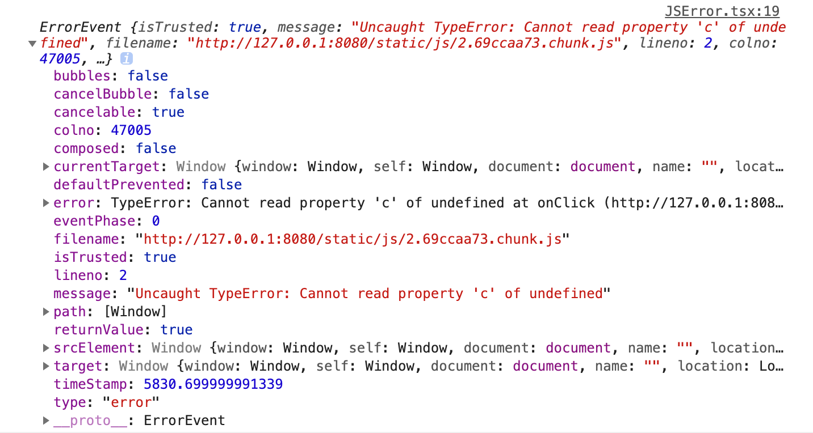
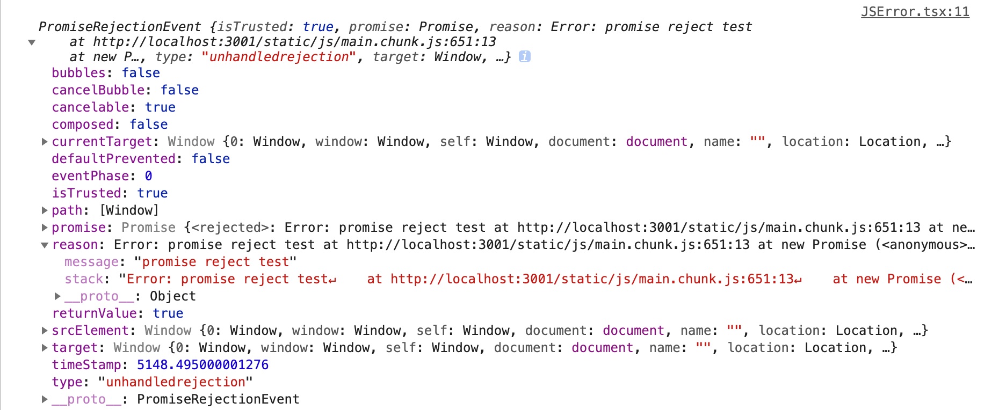

# 异常监控

## js 错误监控

js 错误监控，是前端监控功能中的高频需求，今天我们从原理开始详细介绍 js 错误监控的各个方面。

### 错误收集

我们先手动触发一个错误，看下错误详情

```ts
const jsErrorCallback: (event: ErrorEvent) => void = (event) => {
  console.log('error', event);
};

const jsPromiseRejectionCallback: (event: PromiseRejectionEvent) => void = (
  event
) => {
  console.log('unhandledrejection', event);
};

window.addEventListener('error', jsErrorCallback);
window.addEventListener('unhandledrejection', jsPromiseRejectionCallback);

// 测试触发一个错误
const onTriggerJserror = () => {
  const a = {} as any;
  console.log(a.b.c);
};
// 测试触发reject
const onTriggerUnhandledrejection = () => {
  new Promise(() => {
    throw new Error('promise reject test');
  });
};
```

打印的错误对象信息，如下图：





接下来收集我们需要的信息，上传到服务端

```ts
// view https://microsoft.github.io/PowerBI-JavaScript/interfaces/_node_modules_typedoc_node_modules_typescript_lib_lib_dom_d_.errorevent.html
type ErrorEvent = {
  message: string; // 错误的描述信息
  filename: string; // 发生错误的脚本文件的文件名
  lineno: number; // 错误的行号
  colno: number; // 错误的列号
  error: Error; // 发生错误时所抛出的 Error 对象
}

type PromiseRejectionEvent = {
  promise: Promies;
  reason: any; // 抛出的信息
}

type jsErrorCallbackFn = (event: ErrorEvent) => void;
type jsErrorCallbackFn = (event: PromiseRejectionEvent) => void;

// 错误监听
window.addEventListener('error', jsErrorCallback: jsErrorCallbackFn)
window.addEventListener('unhandledrejection', jsPromiseRejectionCallback)

function jsErrorCallback(event){
  // 构建上传参数
  const params = buildParams(event);
  // 错误上传到服务端
  push(params);
}

function jsPromiseRejectionCallback(event){
  // 构建上传参数
  const params = buildParams(event);
  // 错误上传到服务端
  push(params);
}
```

### source Map

线上环境的代码都是压缩、混淆处理过的，错误信息是不可以读的，这个时候我们需要通过 [sourceMap](https://www.ruanyifeng.com/blog/2013/01/javascript_source_map.html) 反解下错误。

这里我们用火狐开源 [source map](https://github.com/mozilla/source-map) 库。


### 如何实现一个 source map 上传 cli or plugin

### 错误聚合
