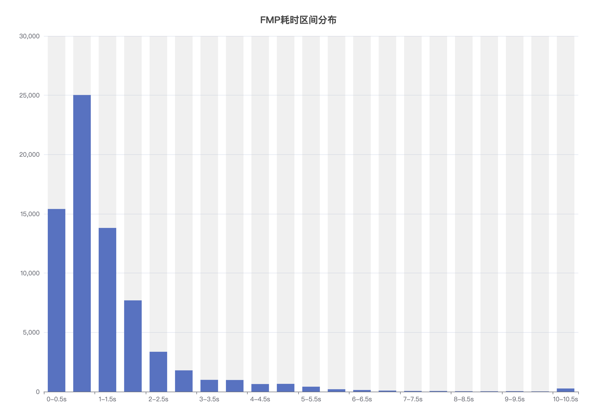
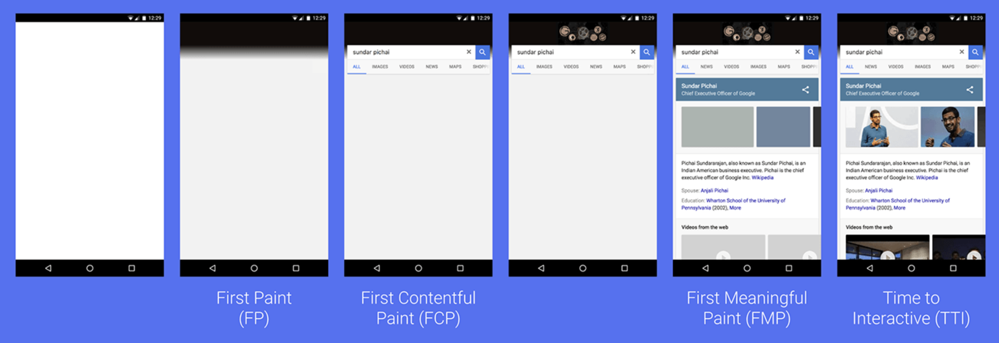

### 以用户为中心的性能监控

我们都知道网站性能很重要。那在说到网站性能、网站速度很快的时候，我们具体指的是什么呢？

首先我们要知道，网站打开速度是一个相对的概念。同一个网站，在高端机上或者网络优良的情况下，可以是很快的，在低端机，网络差的情况却很慢。

下图是一个网站的打开时间分布图，X 轴是耗时区间，Y 轴是用户量。首先从这个图中，我们可以知道，网站打开速度并不是一个固定的数值，而且一个区分分布。虽然大部分用户打开时间在 2s 内，但其实还是存在少量用户，他们的打开时间大于 10 秒。



还有一些其他的概念：

- 两个网站加载时间相同，渐进式渲染的网站比加载完渲染的网站，感觉上会更快。
- 网站加载速度很快，交互响应很慢，我们也会觉得网站性能差。

### 定义指标

那么我们该如果衡量网站性能呢，站在用户的角度上想，我们需要回答一下几个问题？

|                |                                            |
| -------------- | ------------------------------------------ |
| 是否发生？     | 导航发生了吗？服务器响应了吗？             |
| 是否有用？     | 页面是否渲染出足够可用内容                 |
| 是否可用？     | 用户可以与该页面进行交互，还是仍在加载中？ |
| 是否令人愉快？ | 交互是否顺畅自然，没有滞后和卡顿？         |

### 如何度量

先用一个直观的来展示，页面显示的各个阶段。



#### 是否发生 FP 、 FCP

FP (First Paint) 首次绘制，代表浏览器第一次像屏幕传输像素的时间，也就是页面在屏幕上首次发生视觉变化的时间。

FCP (First Contentful Paint) 首次内容绘制，代表浏览器第一次绘制内容的时间。

**如何计算**

```js
function showPaintTimings() {
  if (window.performance) {
    let performance = window.performance;
    let performanceEntries = performance.getEntriesByType('paint');
    performanceEntries.forEach((performanceEntry, i, entries) => {
      console.log(
        'The time to ' +
          performanceEntry.name +
          ' was ' +
          performanceEntry.startTime +
          ' milliseconds.'
      );
    });
  } else {
    console.log("Performance timing isn't supported.");
  }
}

showPaintTimings();
// The time to first-paint was 949.5900000038091 milliseconds.
// The time to first-contentful-paint was 949.5900000038091 milliseconds.
```

> FP 不包含默认背景绘制，但是包含非默认背景绘制。

> 只有绘制文本、图片(包含背景图)、非白色的 svg 或者 canvas 是才被算作 FCP

> [参考文章](https://web.dev/first-contentful-paint/)

### 是否有用 FMP

FMP (First Meaningful Paint) 首次有效绘制，是页面主要内容绘制的时间点。

> [FMP 介绍](../fmp/)

### 是否可用 TTI

TTI (Time to Interactive) 可交互时间，代表网页第一次达到可交互的时间点。首页是页面的 ui 是可交互的状态，并且无场长任务运行，即页面是流畅的。

下图演示了如何查找 TTI。


- 从 FCP 开始，向前搜索一个 5s 以上的静默窗口。静默窗口：无场任务，且网络请求不超过 2 个。
- 从静默窗口往后搜索，最后一个长任务的结束时间，如果搜索不到，则在 FCP 处停止。
- TTI 是静默窗口之前的最后一个长任务的结束时间（如果找不到长任务，则使用 FCP 的值作为 TTI）。

**如何计算**

谷歌团队开发了一个[polyfill](https://github.com/GoogleChromeLabs/tti-polyfill)，用于检测 TTI，适用于所有支持 Long Tasks API 的浏览器。

```js
import ttiPolyfill from './path/to/tti-polyfill.js';

ttiPolyfill.getFirstConsistentlyInteractive(opts).then((tti) => {
  // Use `tti` value in some way.
});
```

> [TTI 介绍](https://web.dev/tti/)

> 长任务(Long Tasks API)：任何连续不间断的且主 UI 线程繁忙 50 毫秒及以上的时间区间。

### 是否令人愉快 长任务监听

页面”是否令人愉快“，主要有几个角度，动画是否流畅，用户交互是否可以快速影响。而卡顿、交互响应慢的情况通常由长任务导致的，了解长任务的发生频率，可以帮助我们判断页面是否流畅。

**如何计算**

```js
var observer = new PerformanceObserver(function(list) {
  var perfEntries = list.getEntries();
  for (var i = 0; i < perfEntries.length; i++) {
    // Process long task notifications:
    // report back for analytics and monitoring
    // ...
  }
});
// register observer for long task notifications
observer.observe({ entryTypes: ['longtask'] });
// Long script execution after this will result in queueing
// and receiving "longtask" entries in the observer.
```

参考文章：https://web.dev/user-centric-performance-metrics/
